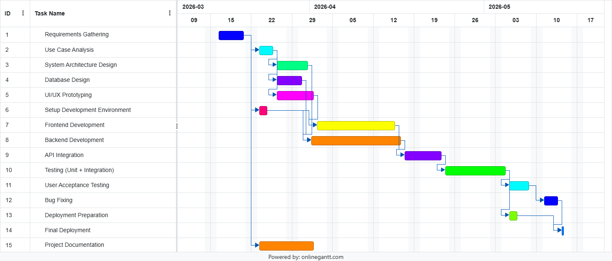
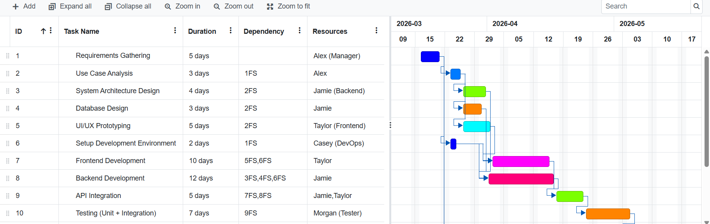
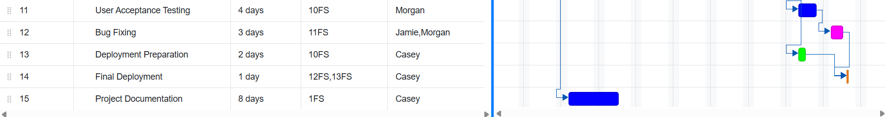
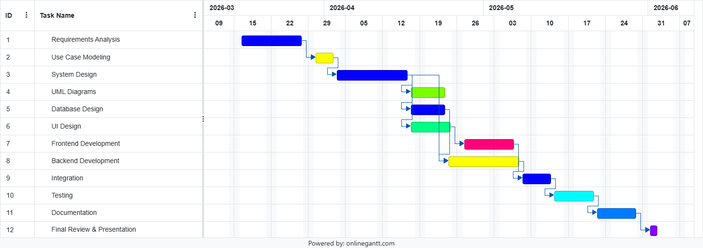
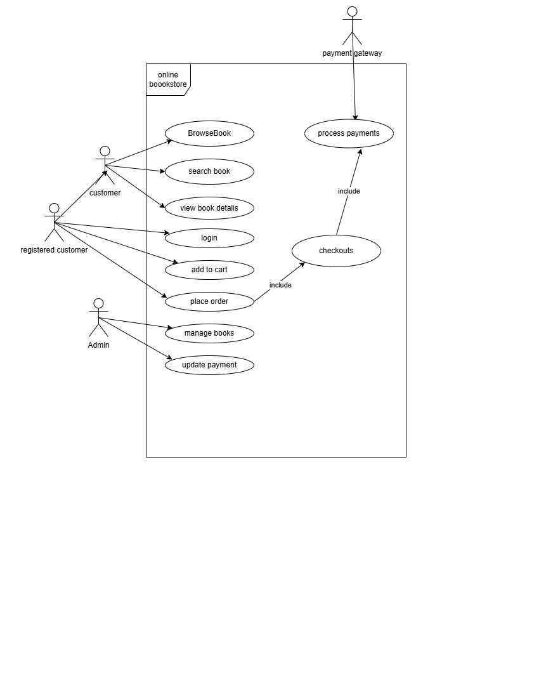
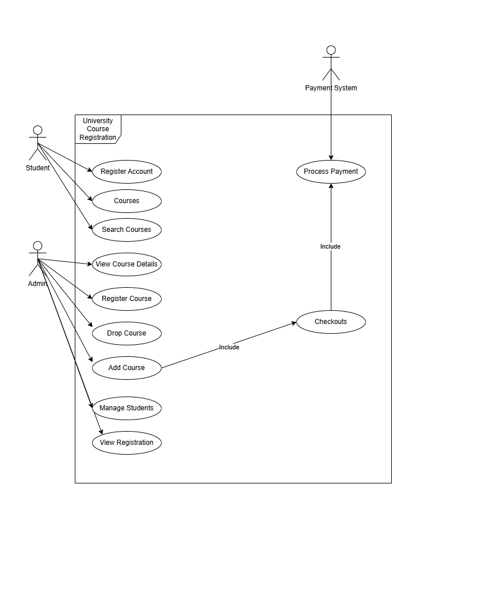

# Project 19: University Course Registration System

## Class Group
Group 1

## Team Members
- Mohammed Nouri – https://github.com/22302754

## Project Description
This project is a simplified university course registration system.
It allows students to register for courses, checks prerequisites,
and ensures class size limits are not exceeded.

## Lab 1 Gantt Chart

## Lab 2 - Resource Allocation

### Explanation
Tasks were assigned based on each role. Backend-related tasks were assigned to the developer responsible for system logic and database design. Frontend and UI tasks were assigned based on design responsibilities. Testing tasks were assigned after development to ensure system quality.

## Project Gantt Chart

# Lab 3: Use Case Diagrams

---

## 📘 Part 1: Online Bookstore

### Actors
- Customer
- Registered Customer
- Admin
- Payment Gateway

### Description
The online bookstore system allows users to browse and search for books, view details, and purchase them. Registered users can log in, add books to a cart, and place orders. The system processes payments through a payment gateway and sends confirmations via email. Admins manage books and update order status.

### Diagram

---

## 🎓 Part 2: University Course Registration System

### Actors
- Student
- Admin
- Payment System

### Description
The university course registration system allows students to browse courses, search, and register for them. The system checks prerequisites and availability before enrollment. Students can also drop courses and pay fees through an external payment system. Admins manage courses, students, and registrations.

### Diagram

