# Project 19: University Course Registration System

## Class Group
Group 1

## Team Members
- Mohammed Nouri – https://github.com/22302754

## Project Description
This project is a simplified university course registration system.
It allows students to register for courses, checks prerequisites,
and ensures class size limits are not exceeded.

## Lab 1 Gantt Chart
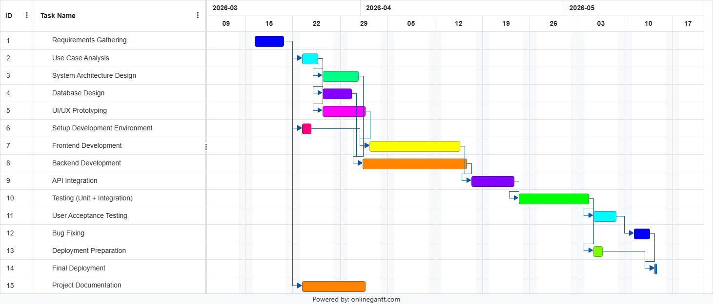

## Lab 2 - Resource Allocation

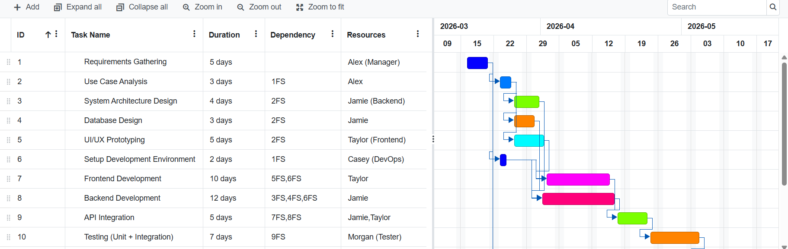
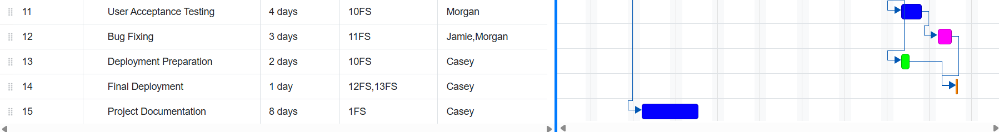

### Explanation
Tasks were assigned based on each role. Backend-related tasks were assigned to the developer responsible for system logic and database design. Frontend and UI tasks were assigned based on design responsibilities. Testing tasks were assigned after development to ensure system quality.

## Project Gantt Chart

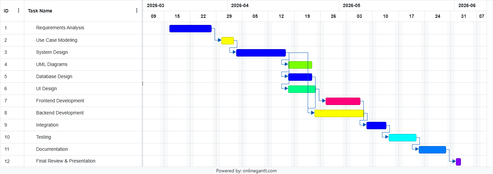

# Lab 3: Use Case Diagrams

---

## 📘 Part 1: Online Bookstore

### Actors
- Customer
- Registered Customer
- Admin
- Payment Gateway

### Description
The online bookstore system allows users to browse and search for books, view details, and purchase them. Registered users can log in, add books to a cart, and place orders. The system processes payments through a payment gateway and sends confirmations via email. Admins manage books and update order status.

### Diagram
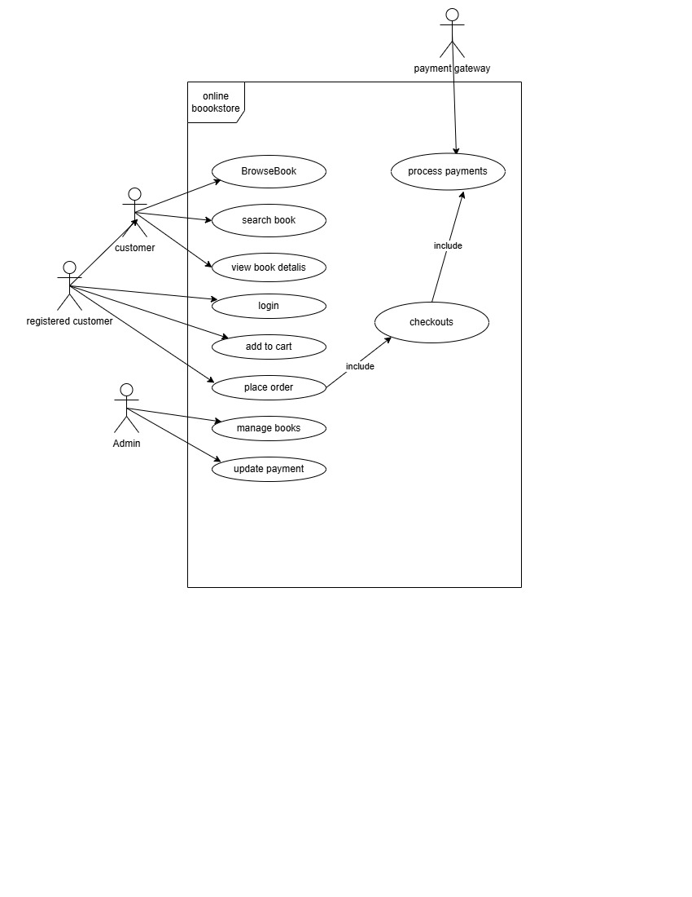

---

## 🎓 Part 2: University Course Registration System

### Actors
- Student
- Admin
- Payment System

### Description
The university course registration system allows students to browse courses, search, and register for them. The system checks prerequisites and availability before enrollment. Students can also drop courses and pay fees through an external payment system. Admins manage courses, students, and registrations.

### Diagram
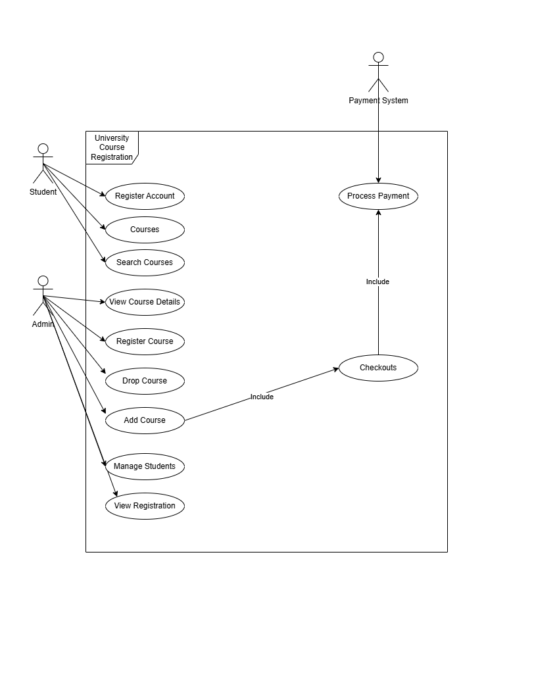

## Lab4: Sequence Diagrams

---

## Part 1: Libary Kiosk

### Diagram
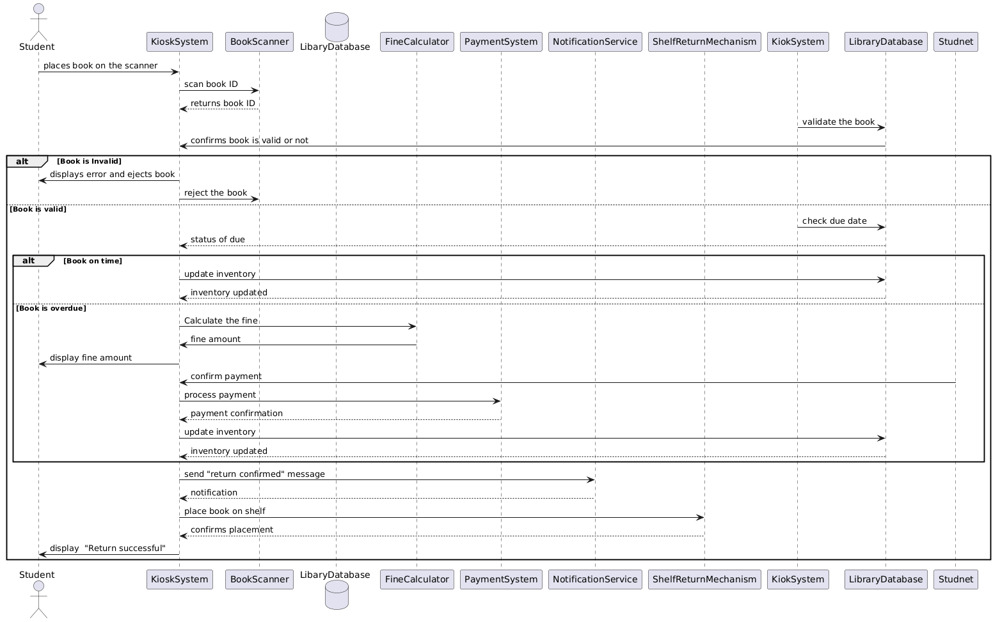

### Description
Library Kiosk:  Student places the book, scanner reads the ID, LibraryDatabase confirms it's valid and on time, KioskSystem updates inventory, NotificationService sends confirmation, and ShelfReturnMechanism shelves the book. Alternative (overdue) — LibraryDatabase reports overdue; FineCalculator computes the fine, student pays via PaymentSystem, then inventory is updated and the rest of the flow proceeds. Alternative (invalid) — KioskSystem displays an error and ejects the book.

## Part 2: Add_Course 

### Diagram
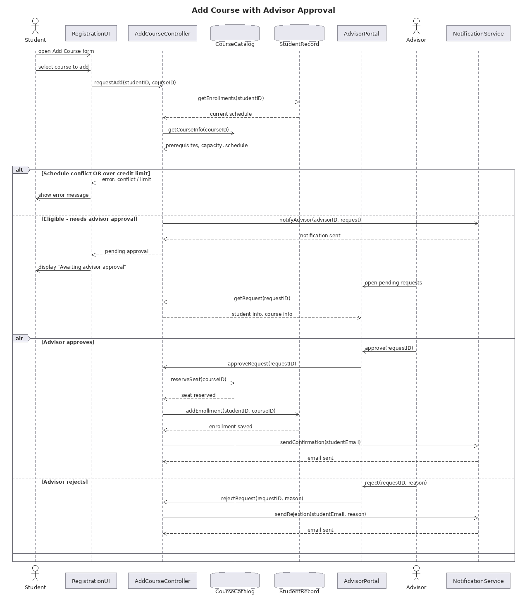

### Description
Add Course: The student requests to add a course; the controller checks current enrollments and course details, and if eligible, notifies the advisor and shows "Awaiting approval". The advisor reviews the request via AdvisorPortal — on approval the system reserves a seat, saves the enrollment, and emails confirmation; on rejection it emails the reason. If the initial check fails (schedule conflict or credit limit exceeded), the request is rejected immediately without contacting the advisor.

## Lab5: Activity Diagrams

---

## Part 1: Libary Kiosk

### Diagram
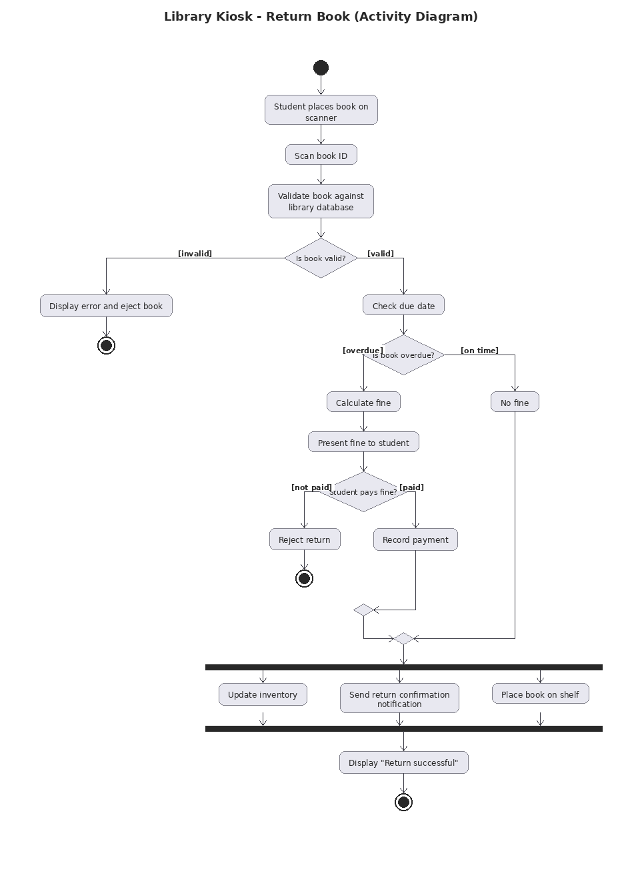

### Description
Part 1 (Library Kiosk): The workflow starts with the student placing a book on the scanner and the system validating it. Three decision points control the flow — book validity (invalid ends the process), overdue status (overdue triggers fine calculation), and fine payment (refusal rejects the return). Once the book is accepted, three activities run in parallel via fork/join: updating inventory, sending the confirmation notification, and shelving the book.

---

## Part 2: Tuition Payment

### Diagram
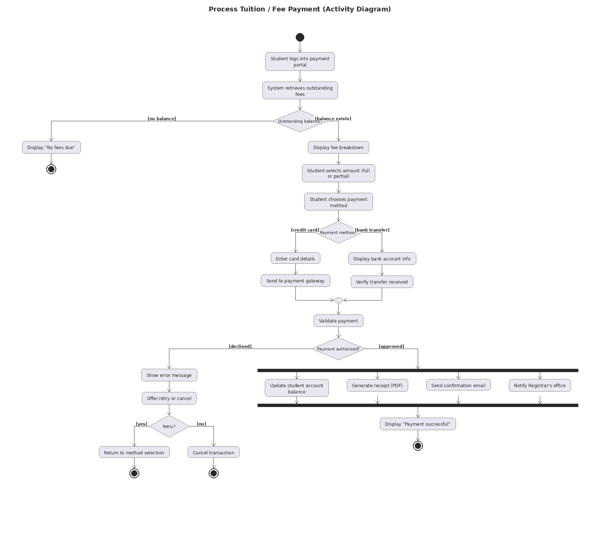

### Description
Part 2 (Tuition Payment): The student logs in and the system retrieves outstanding fees. Decision points handle balance check, payment method (credit card vs bank transfer — branches merge before validation), authorization, and a retry option on decline. On approval, four activities run concurrently: updating the account balance, generating a PDF receipt, sending a confirmation email, and notifying the Registrar's office — they're independent and parallel for faster processing.

## Lab 6 - Data Flow Diagrams (DFDs)

---

## Part 1: 1.Context Diagram

### Diagram
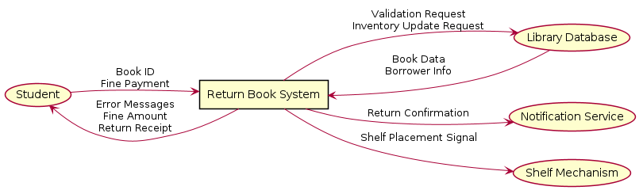

---

## 2.Level 1 DFD

### Diagram
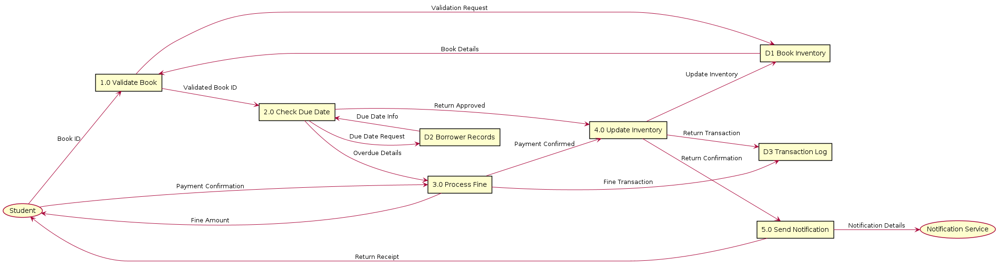

---

## 3.Level 2 DFD

### Diagram
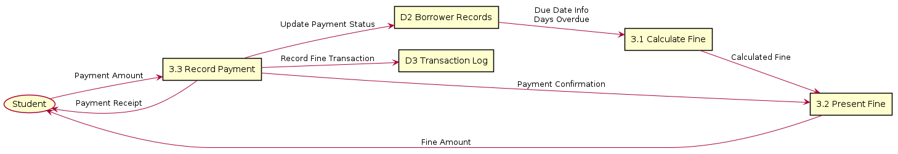

### Description
Part 1 (Library Kiosk): Three DFDs decomposing the Return Book System. The context diagram shows interaction with 4 external entities (Student, Library Database, Notification Service, Shelf Mechanism). Level 1 splits the system into 5 sub-processes accessing 3 data stores (Book Inventory, Borrower Records, Transaction Log). Level 2 expands Process 3.0 (Process Fine) into Calculate Fine → Present Fine → Record Payment.

## Part 2: 1.Context Diagram

### Diagram
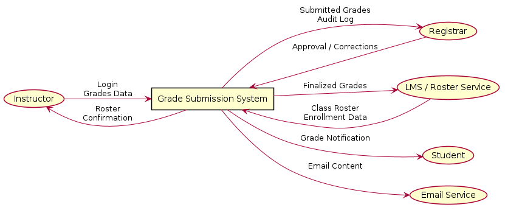

---

## 2.Level 1 DFD

### Diagram
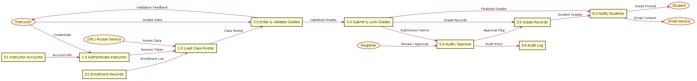

---

## 3.Level 2 DFD

### Diagram
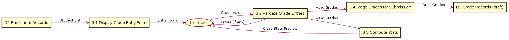

### Description
Part 2 (Submit Final Grades): Context diagram shows the Grade Submission System exchanging data with Instructor, Registrar, Student, Email Service, and LMS/Roster Service. Level 1 decomposes the workflow into 6 sub-processes (authentication, roster loading, grade entry, submission/locking, registrar audit, student notification) using 4 data stores. Level 2 expands Process 3.0 (Enter & Validate Grades) into form display, validation, stats computation, and staging for submission.

